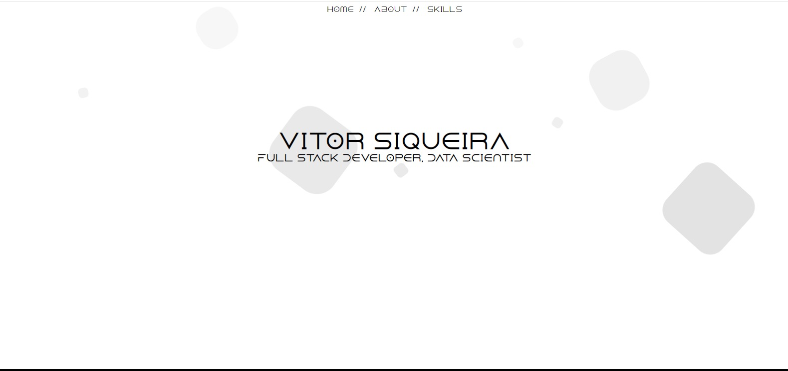

# Portfólio

Este é o meu portfólio pessoal, um site que desenvolvi utilizando apenas HTML e CSS puro. Possui um design moderno, com um fundo animado e cores minimalistas.

## Recursos

- **HTML e CSS Puro:** O site foi construído utilizando apenas HTML e CSS, sem o uso de frameworks ou bibliotecas adicionais, para demonstrar minhas habilidades front-end.

- **Fundo Animado:** O fundo do site é animado, proporcionando uma experiência visual dinâmica para os visitantes.

- **Cores Minimalistas:** Optei por uma paleta de cores minimalistas, que contribui para um design limpo e moderno.

## Visualização

Você pode visualizar o meu portfólio online [aqui](https://portfolio-three-henna-90.vercel.app/).

## Capturas de Tela




## Como Executar Localmente

Se você deseja executar o site localmente em sua máquina, siga estas etapas:

1. Clone este repositório:

   ```bash
   git clone https://github.com/vitorSiquera/Portfolio.git